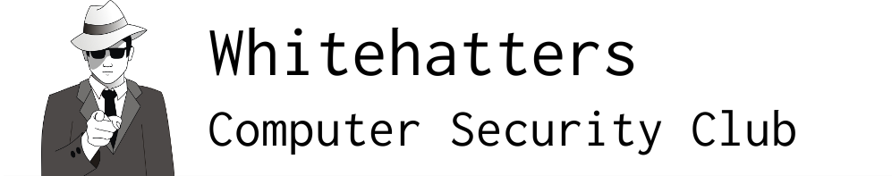

# Whitehatters Computer Security Club History

## Inspiration and Validity Disclaimer

The effort to record WCSC history began in 2019 by Kevin Orr, inspired by the passing of Joe Rogers.

Due to the late start, there are many gaps in our knowledge. Significant effort was put into verifying the accuracy of the following, but it cannot be guranteed. If you have information on WCSC's past, please submit a pull request or message one of the current EBoard members.

# Photos

For any historic photos we've collected, see the [photos](photos) directory.

# 2025

## Eboard

- President: Fagan Afandiyev
- Vice President: Tyler Krapfl
- Treasurer: Aylin Masiyeva
- Secretary: Stanley Mmayie
- System Administrator: Jun "Sky" Lu
- Public Relations: Devon Chavarria

# 2024

The Blue Team Captain Position has been morphed into System Administrator as Whitehatters is no longer able to do competitions that necessitated it.

## Eboard

- President: Jackson Liveringhouse
- Vice President: Bilal Saeed
- Treasurer: Grant Stevens
- Secretary: Fagan Afandiyev
- System Administrator: Zachary Long
- Public Relations: Public Relations

# 2023

## Eboard

- President: Austin Worline (stepped down)
- Vice President/Interim President: Jacob Hammargren
- Treasurer: Jackson Liveringhouse
- Secretary: Elias Peters
- Blue Team Captain/Interim Vice President: Brandon Gonzalez
- Public Relations: Rin Lang

# 2022

## Eboard

- President: Waseem Albaba
- Vice President: Christopher Greenland
- Treasurer: Bilal Joud
- Secretary: Ethan Couch
- Blue Team Captain: Austin Worline
- Public Relations: Ishana Maharaj

# 2021

## Eboard

- President: Julie Gonzalez
- Vice President: Christopher Greenland
- Treasurer: Alex Whitaker
- Secretary: Waseem Albaba
- Blue Team Captain: Nicholas Gonzalez
- Public Relations: David Bravo

# 2019-2020

Whitehatters 24/7 CTF board was restored during the 2019-2020 period. In addition, the first CodeBreakHERS camp, a cryptography summer camp for high school girls, was held during the summer of this year.

## Eboard

- President: Truvis (@truvis)
- Vice President: Kevin Dennis (@ktrio3)
- Treasurer: Alexandra Whitaker (@Whitaker)
- Secretary: Christopher Greenland (@Christopher)
- Blue Team Captain: Jacob Kesler (@JK42)
- Public Relations: Julie Gonzalez (@jules)

# 2018-2019

The 2018-2019 Eboard designed a new, modern website for WCSC.

Add CTF wins (airport one and FC^2)

## Eboard

- President: Farooq Shaikh (@bao)
- Vice President: Kevin Orr (@kevin)
- Treasurer: Patricia Wilthew (@patrixia)
- Secretary: Oshien Nellissery (@oshien)
- Blue Team Captain: Jordan Bermudez (@silexone)

# 2017-2018

- [Held the second ctf at the Florida Cybersecurity Fourth Annual Conference](https://vimeo.com/214490917)
- [Partnered with the Florida Center for Cybersecurity for GenCyber 2017 Student and Instructor Training](https://vimeo.com/226755825)

## Ebaord

- President: Brad Daniels (@bradd)
- Vice President: Farooq Shaikh (@bao)
- Treasurer: Kyler Clonts (@kclonts)
- Secretary: Patricia Wilthew (@patrixia)
- Blue Team Captain: Jordan Bermudez (@silexone)

# 2016-2017

- [Held the first ctf at the Florida Cybersecurity Third Annual Conference](https://vimeo.com/214490917)
- [Partnered with the Florida Center for Cybersecurity for GenCyber 2016 Student and Instructor Training](https://vimeo.com/179247653)
- [Partnered with Florida Center for Cybersecurity on NSFNF Program to conduct The Challenge CTF](https://vimeo.com/179326782)
- Partnered with USF Honors College to develop and instruct Cyber Defense Boot Camp Pre-College Program during Summer 2016
- Winner of BSides Orlando SunshineCTF 2016

## Eboard

- President: Kris Willis (@xan)
- Vice President: Ian Guibas (@PhantomOfTheNOPera)
- Secretary: Brad Daniels (@bradd)
- Treasurer: Kareem Rigaud

# 2015-2016

- Dr. Xinming (Simon) Ou became faculty advisor
- Jeremy Rassmussen became founding advisor
- Reliaquest Sponsorship
- SECCDC 2nd Place (xan, bspar, duck, spaghetti, aterribleloss, restova)
- Started holding three seperate meetings (traditional Friday, Advanced, Defense(CCDC))

## Eboard

- President - Kris Willis (@xan)
- Vice President - Sean Murphy (@duck)
- Treasurer - Zach Winnerman
- Secretary - Bader AlBassam (@gh0s1)

# 2014-2015

## Eboard

- President: Will Seed (@wseed)
- Vice President: Brad Trotter (@bt)
- Secretary: Sean Murphy (@duck)
- Treasurer: Todd Knieriemen

# 2013-2014

## Eboard

- President: Luke Hritsko (@rastii)
- Vice President: Andrew Calvano (@acalvano)
- Treasurer: Brad Trotter (@bt)
- Secretary: Natalie Edinger

# 2012-2013

## Eboard

- President: Nathan Baron (@baronvon)
- Treasurer: Bader AlBassam (@gh0s1)

# 2011-2012

[WCSC at SECCDC](https://www.youtube.com/watch?v=893ej1Ubn_k)

@sigtrap designed a new logo based on the [glider](https://en.wikipedia.org/wiki/Glider_(Conway%27s_Life)) from [Conway's Game of Life](https://en.wikipedia.org/wiki/Conway%27s_Game_of_Life), a popular symbol of hacker culture.

## Eboard

- President: Allison Kline (@sigtrap)
- Vice President: Nathan Baron (@baronvon)
- Treasurer: John (@ninjafish)

# 2010-2011

New logo design drawn by @fuzyll's (now wife) girlfriend to motivate new interest in the club.

## Eboard

- President: Alex Taylor (@fuzyll)
- Vice President: Chris Head
- Treasurer: Bhargava Kondaveeti
- Secretary: Clayton Whitelaw

# 2009-2010

## Eboard

- President: Chris Lewis (@jetboy)

# 2008-2009

## Eboard

- President: Chris Lewis (@jetboy)

# 2007-2008

## Eboard

- President: Shawn Baker (@Zap)

# 2006-2007

## Eboard

- President: Bryce Kerley (@BonzoESC)

# 2005-2006

## Eboard

- President: Jim Connor (@jymbolia)
