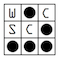

# Whitehatters Computer Security Club History

## Inspiration and Validity Disclaimer

The effort to record WCSC history began in 2019 by Kevin Orr, inspired by the passing of Joe Rogers. 

Due to the late start, there are many gaps in our knowledge. Significant effort was put into verifying the accuracy of the following, but it cannot be guranteed. If you have information on WCSC's past, please submit a pull request or message one of the current EBoard members.

# 2019-2020

Whitehatters 24/7 CTF board was restored during the 2019-2020 period. In addition, the first CodeBreakHERS camp, a cryptography summer camp for high school girls, was held during the summer of this year.

## Eboard
- President: Truvis (@truvis)
- Vice President: Kevin Dennis (@ktrio3)
- Treasurer: Alexandra Whitaker (@Whitaker)
- Secretary: Christopher Greenland (@Christopher)
- Blue Team Captain: Jacob Kesler (@JK42)
- Public Relations: Julie Gonzalez (@jules)

# 2018-2019

The 2018-2019 Eboard designed a new, modern website for WCSC.

Add CTF wins (airport one and FC^2)

## Eboard

- President: Farooq Shaikh (@bao)
- Vice President: Kevin Orr (@kevin)
- Treasurer: Patricia Wilthew (@patrixia)
- Secretary: Oshien Nellissery (@oshien)
- Blue Team Captain: Jordan Bermudez (@silexone)

# 2017-2018

Held the first ctf at the Florida Cybersecurity Conference

## Ebaord

- President: Brad Daniels (@bradd)
- Vice President: Farooq Shaikh (@bao)
- Treasurer: Kyler Clonts (@kclonts)
- Secretary: Patricia Wilthew (@patrixia)
- Blue Team Captain: Jordan Bermudez (@silexone)

# 2016-2017

## Eboard

- President: Kris Willis (@xan)
- Vice President: Ian Guibas (@PhantomOfTheNOPera)
- Secretary: Brad Daniels (@bradd)
- Treasurer: Kareem Rigaud

# 2015-2016

## Eboard

- President - Kris Willis (@xan)
- Vice President - Sean Murphy (@duck)
- Treasurer - Zach Winnerman
- Secretary - Bader AlBassam (@gh0s1)

# 2014-2015

## Eboard
- President: Will Seed (@wseed)
- Vice President: Brad Trotter (@bt)
- Secretary: Sean Murphy (@duck)
- Treasurer: Todd Knieriemen

# 2013-2014

## Eboard

- President: Luke Hritsko (@rastii)
- Vice President Brad Trotter (@bt)
- Secretary: Bader AlBassam (@gh0s1)

# 2012-2013

## Eboard

- President: Nathan Baron (@baronvon)
- Treasurer: Brad Trotter (@bt)

# 2011-2012

[WCSC at SECCDC](https://www.youtube.com/watch?v=893ej1Ubn_k) 

@sigtrap designed a new logo based on the [glider](https://en.wikipedia.org/wiki/Glider_(Conway%27s_Life)) from [Conway's Game of Life](https://en.wikipedia.org/wiki/Conway%27s_Game_of_Life), a popular symbol of hacker culture.

## Eboard

- President: Allison Kline (@sigtrap)
- Treasurer: Bader AlBassam (@gh0s1)

# 2010-2011

New logo design drawn by @fuzyll's (now wife) girlfriend to motivate new interest in the club. 

## Eboard

- President: Alex Taylor (@fuzyll)

# 2009-2010

## Eboard

- President: Chris Lewis (@jetboy)

# 2008-2009

## Eboard

- President: Chris Lewis (@jetboy)

# 2007-2008

## Eboard

- President: Shawn Baker (@Zap)

# 2006-2007

## Eboard

- President: Bryce Kerley (@BonzoESC)

# 2005-2006

## Eboard

- President: Jim Connor (@jymbolia)