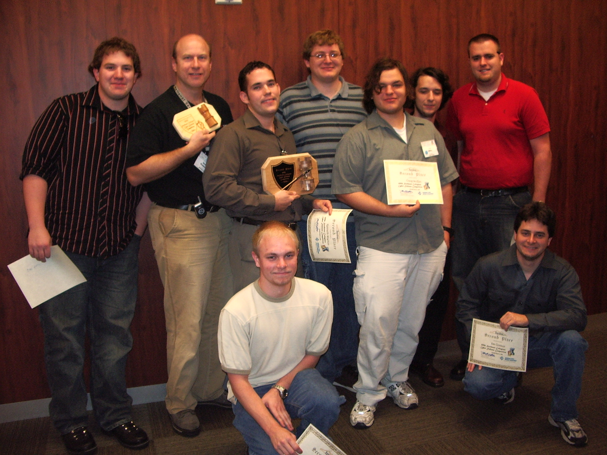
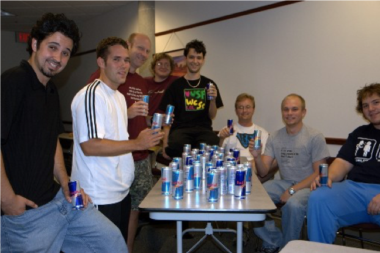
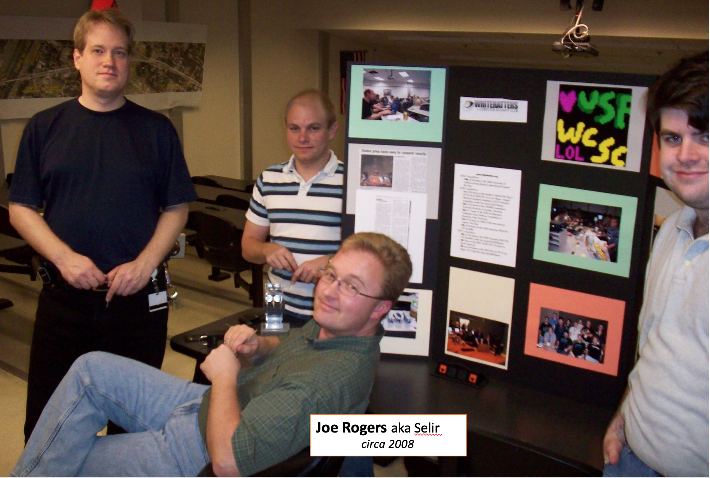
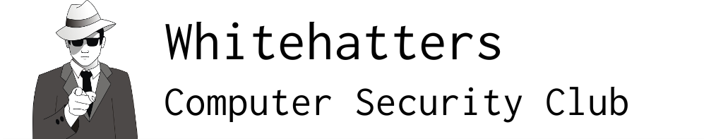
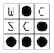
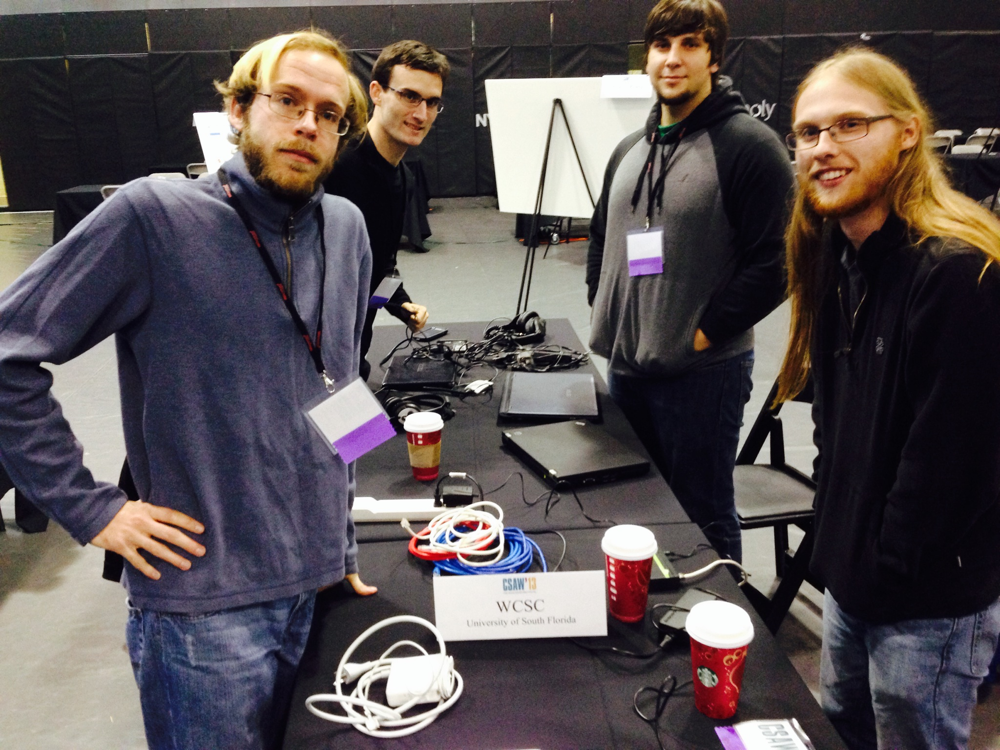
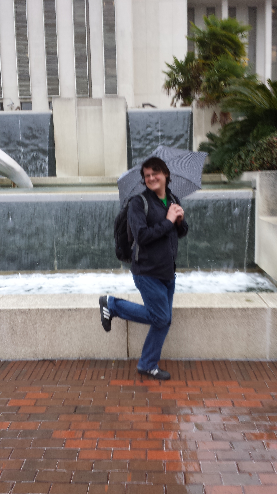
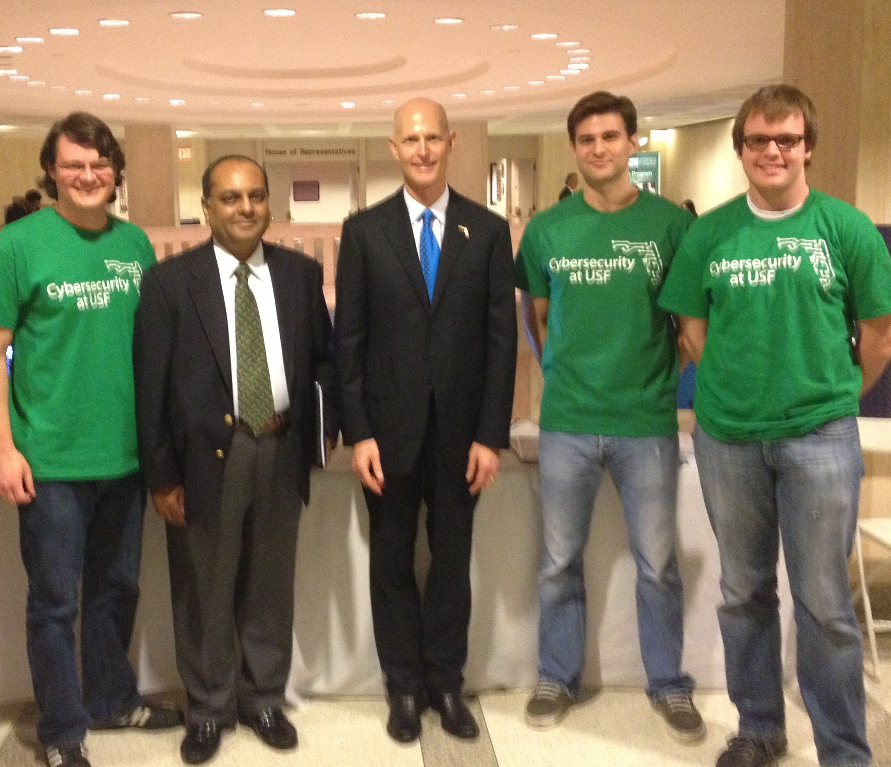
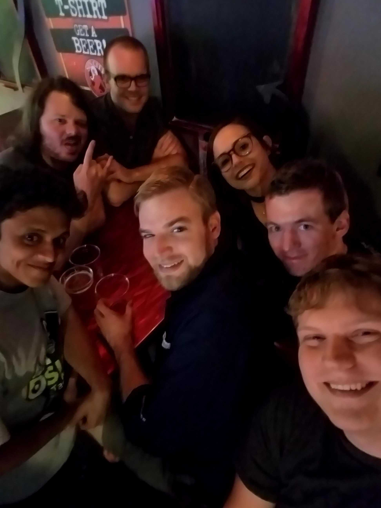
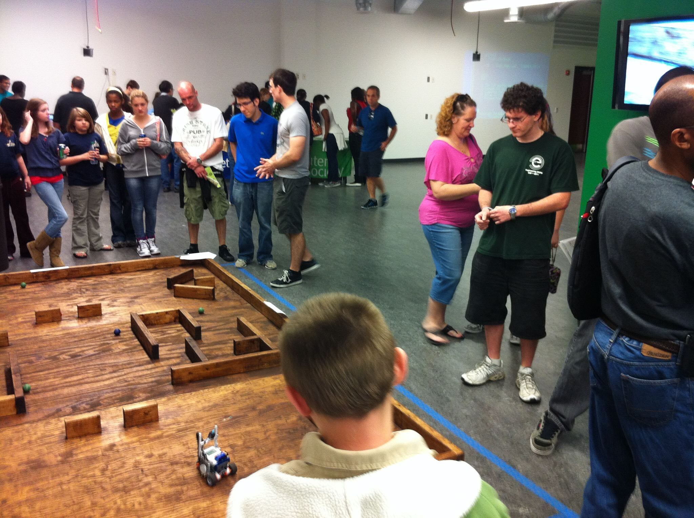

# Photos

### 2006

#### SECCDC 2006

[[source](https://wcscusf.slack.com/archives/C09GX359N/p1560344084008900)]

From @triple-h:

> Back, L to R: Matt Boksa (DJ Mitch Mitchem), @triple-h, Kenny Shelton (racerx), Bryce Kerley (bonzoesc or vito), Craig Sniffen, @dfraze, Ryan Dorey. Front, L to R: @jetboy, Jim Connor (jymbolia).

### 2007

#### Unknown

From @triple-h:

> Matt Boksa got us a Red Bull sponsorship that year.

### 2008

#### Engineering Expo 2008

[[source](https://wcscusf.slack.com/archives/C09GX359N/p1560341121005700)]

From @triple-h:

> Here’s Joe [Rogers] at USF Engineering Expo in 2008 with Toivo, Chris, and Jay.

### 2010

#### New Logo

From @fuzyll:

> yeah, that’s the one that i had my girlfriend (now wife) draw for me. when i took over the club in early 2010, i didn’t even know we _had_ a logo - the old one (which is the slack icon) wasn’t really “in use” anymore (we only had 4 people left in the club by then lol)
> so, in an effort to get more people into the club, i came up with an entirely new branding for it and printed fliers and gave pitches in comp sci classes trying to get more people to show up
> as i recall it, one of the former members of the club (might’ve been @hoju, actually?) pointed out that we _did_ have a logo and gave me the `.bmp` file
and i went back to using that one for CTFs

### 2011

#### New Logo

From @fuzyll:

> once i graduated, allison (president after me) created the “glider” logo that people have been using since

### 2013

#### CSAW Finals

From @triple-h:

> WCSC at CSAW finals in NYC at NYU Poly, 2013. From L to R: @macrotis, @acalvano, @rastii, @strudels

### 2014

#### WCSC at the Florida Capital

On February 12th, 2014, WCSC got to visit the Florida Capital. 

From @bt:

> @bt at the Florida capital

From @bt:

> @bt @thwam @bspar at the capital with Gov Rick Scott

### 2018

#### WCSC at DEFCON 26

Whitehatters meeting up at DEFCON 26 on August 9th for drinks.

From @truvis:

> From DEFCON 26 @truvis @ktrio3 @bao @patrixia @bspar @aterribleloss @bt

> @thwam was there too, but he was at the bar

### Unknown date

#### Engineering Expo 20??

